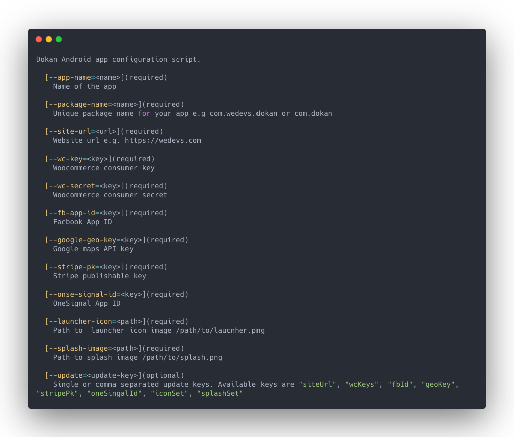
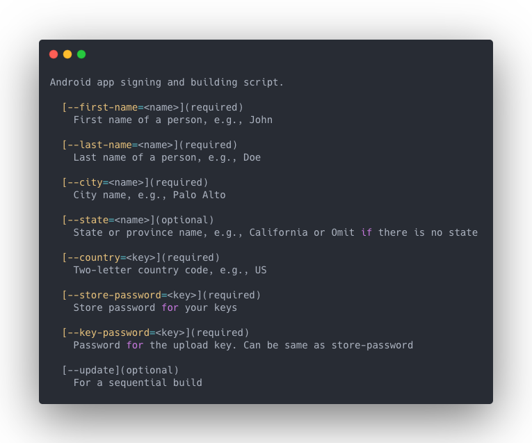
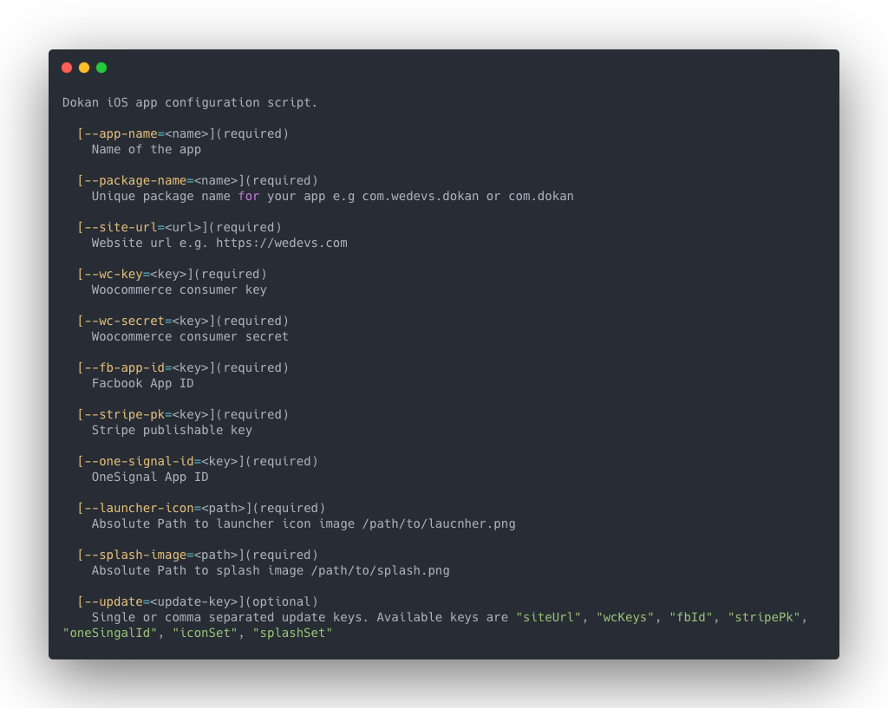

# Dokan App Build Scripts

Commandline scripts for building customized Dokan App for a marketplace. **These scripts can only be run on a Linux or Mac OS machine.**

Quick Links: [Dependencies](#dependencies) | [Installation](#installation) | [Usage](#usage) | [Android](#android) | [iOS](#ios) | [Subsequent Configuration](#subsequent-configuration) | [Subsequent Build](#subsequent-build)

## Dependencies

Before using these scripts, a development environment needs to be configured for building a React Native app in your Machine/Server. See "React Native CLI Quickstart" section in [React Native's Official Doc](https://facebook.github.io/react-native/docs/getting-started)

Additionally, the following tools need to be installed in your system

- [plutil](http://manpages.ubuntu.com/manpages/precise/man1/plutil.1.html)
- [XMLStarlet](http://xmlstar.sourceforge.net/)
- [jq](https://stedolan.github.io/jq/download/)
- [imagemagick](https://imagemagick.org/index.php)
- [react-native-rename](https://github.com/junedomingo/react-native-rename)

## Installation

Run this command in your terminal to install the build scripts.

`wget -O - https://raw.githubusercontent.com/weDevsOfficial/dokan-app-build-script/master/setup.sh | bash`

Test your installation by running any of `config-android`, `build-android` or `config-ios` commands

## Usage

In your termial create a new directory like `mkdir "My Projects"` and `cd` into it or `cd` the directory where you want to save your projects. For convenience create an `assets` directory there and put the app icon and splash image inside the `assets` directory. It will be useful later on.

### Android

In two steps you can generate an [Android App Bundle](https://developer.android.com/guide/app-bundle). This is the new(and recommended) way of uploading android apps to Google Play Store. At first run `config-android`

It will list the parameters that are needed to be supplied with the command. The list is self explanatory.



Now run the command as follows, replacing the placeholder values with the actual ones

```bash
  config-android --app-name=MyApp --package-name=com.exmaple.app --site-url=https://example.com --wc-key=somekey --wc-secret=somesecret --fb-app-id=facebookappid --google-geo-key=googlemapapikey --launcher-icon=absolute/path/to/laucnher.png --splash-image=absolute/path/to/splash.png
```

If there is spacing in the app name, surround the app name with double qoutes `--app-name="My App"` like this. If you have an **assets** directory with app icon and splash image inside, you can specify the launcher icon path and splash image path like this `--launcher-icon=absoulte/path/to/assets/launcher.png` and `--splash-image=absoulte/path/to/assets/splash.png`. **Note** the `absolute/path/to` part. Incase you want to find the absolute path of your **assests** directory `cd` into **assests** and then run `pwd`. It will print the required path.

After successful completion of the above command you will have a new Android project configured.

Now run `build-android` to see the list of parameters.



Now `cd MyApp` and run the following command. Of course replacing the placeholder values with actual ones.

```bash
  build-android --first-name=John --last-name=Doe --city=LosAngeles --state=California --country=US --store-password=somepassword --key-password=somepassword
```

This will perform the [code signing](https://developer.android.com/studio/publish/app-signing) of the app and generate an `app.aab` inside `MyApp/android/app/build/outputs/bundle/release/` directory. Your new app has been built and is ready to be uploaded to Google Play Store.

### iOS

iOS configuration script is almost same as Android except the `--google-geo-key` option is not required here. Run 'config-ios' to see the list of parameters.



Run the following command as follows

```bash
  config-ios --app-name=MyApp --package-name=com.exmaple.app --site-url=https://example.com --wc-key=somekey --wc-secret=somesecret --fb-app-id=facebookappid --launcher-icon=path/to/laucnher.png --splash-image=path/to/splash.png
```

This will download, create and configure a new iOS project. If there is already an existing project created for Android, this command will just configure the iOS project for you without downloading and creating a new one.

**Note** `config-android` and `config-ios` both commands are kind of complementary to each other. If you have configured for Android before, `config-ios` will configure the iOS project without creating a new one and vice versa. All you need to do, is to be in the same directory level where the project exists.

### Subsequent Configuration

Creating and configuring a new project takes a significant amount of time. It may happen that you have passed wrong values to the arguments of `config-android` or `config-ios` command and configured the Android or iOS project. You can revert this by using the `--update` argument for both `config-android` and `config-ios` commands without creating a new project.

For example, you have created an Android project where the `--site-url` was wrong. To change this run the config-android command like this

```bash
  config-android --app-name=MyApp --site-url=newSiteUrl --update=siteUrl
```

Notice `--update=siteUrl` part. This will update the wrong `--site-url` with the correct ones.

You can also update multiple values at once. Assuming you want to correct the `--site-url` and `--fb-app-id` for Android, run `config-android` like below

```bash
  config-android --app-name=MyApp --site-url=newSiteUrl --fb-app-id=newfacebookappid --update=siteUrl,fbId
```

Pass the update keys in a comma separated manner to the `--update` argument. Only remeber there is no space after a `,` and the last update key should not contain a `,`. The same approach applies to `config-ios` command.

Below is the list of available update keys

| Update Keys | Function                                                    | Android | ios |
| ----------- | ----------------------------------------------------------- | :-----: | :-: |
| siteUrl     | Updates site url                                            |    √    |  √  |
| wcKeys      | Updates WooCommerce consumer key or consumer secret or both |    √    |  √  |
| fbId        | Updates Facebook App Id                                     |    √    |  √  |
| geoKey      | Updates Gogole Map API key                                  |    √    |  X  |
| iconSet     | Generates new icon set from the updated path                |    √    |  √  |
| splashSet   | Generates new splash image set from the updated path        |    √    |  √  |

**Note:** The `--app-name` argument is mandatory when you are trying to update. The `wcKeys` update key can update only `--wc-key` or only `--wc-secret` or both. For example

```bash
  config-android --app-name=MyApp --wc-key=newKey --update=wcKeys
```

This will only update the WooCommerce consumer key

Or

```bash
  config-android --app-name=MyApp --wc-secret=newSecret --update=wcKeys
```

This will only update the WooCommerce consumer secret

And

```bash
  config-android --app-name=MyApp --wc-key=newKey --wc-secret=newSecret --update=wcKeys
```

This will update both WooCommerce consumer key and secret.

### Subsequent Build

When an existing Android or iOS project is subsequently configured, it must be built again.

To do this for Android, first `cd` into your project. In our example case `cd MyApp`. Then run `build-android --update`. It will generate the updated `.aab` for your app.
